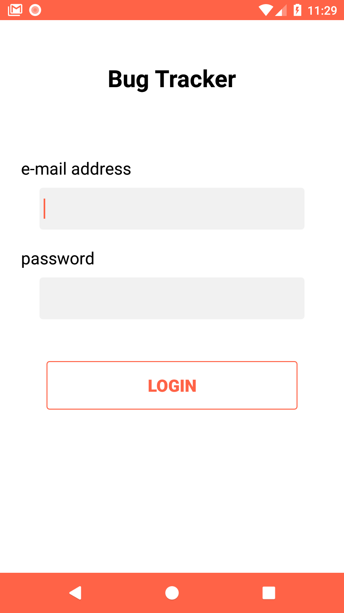
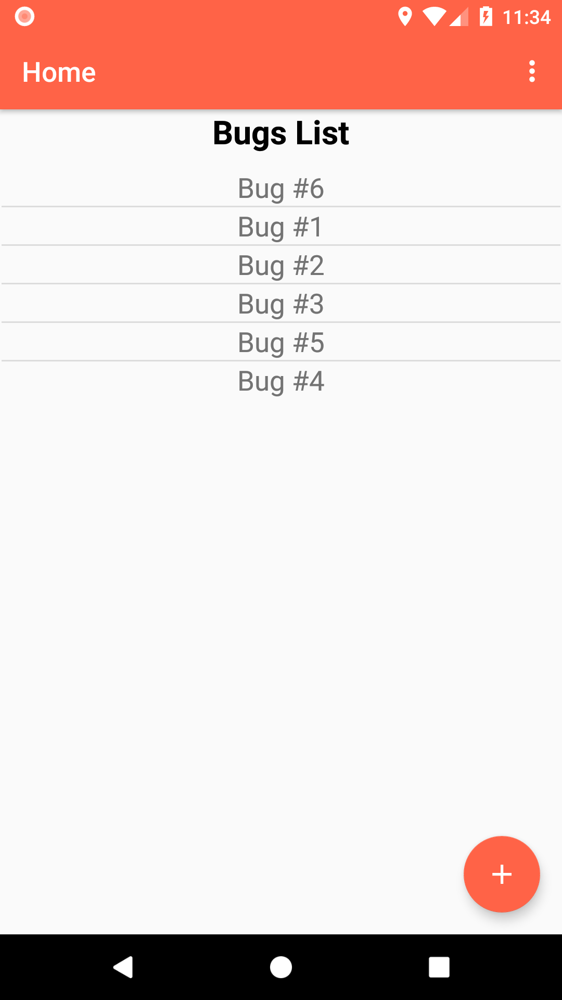
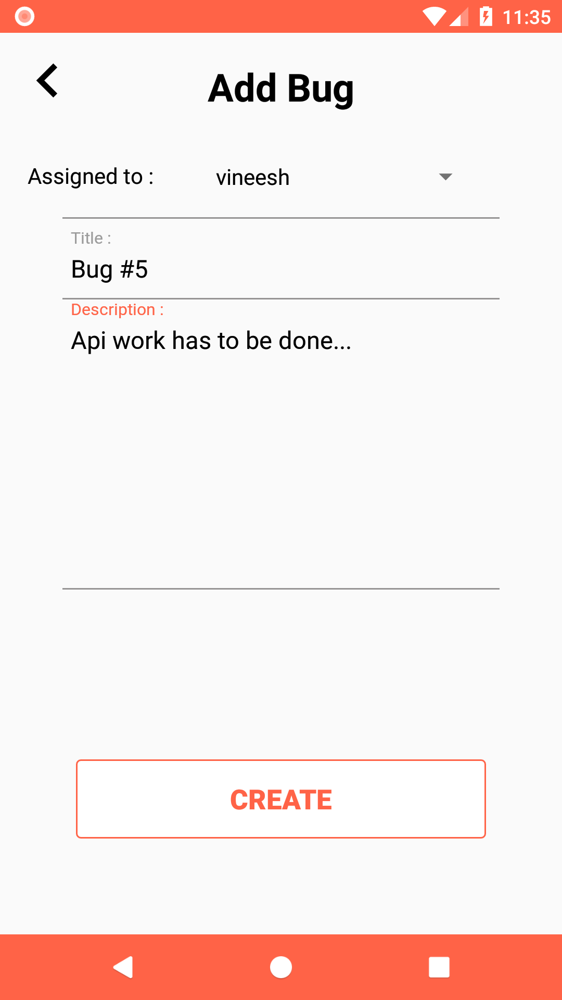

# BugTracker Android App

It is a simple Android app for tracking bugs and uses apollo client for communitcating with the backend.

## Server

[Bug tracker Server](https://github.com/vineeshvk/BugTrackerServer) is the server used as a backend for this android.

## Apk
[BugTracked.apk](./app/release/app-release.apk)

### Features
- create user(admin or normal)
- login
- create bug and assign
- view bugs
- change status of bugs

### Screenshots
 

### Requirements
- server(connect the ip address)
- android studio

### Libraries used
- [Apollo-client](https://www.apollographql.com/docs/android/essentials/get-started.html)

